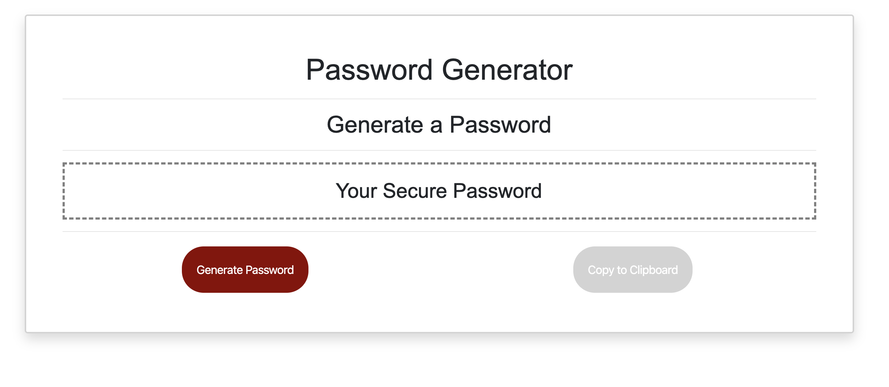

# password-generator

This application generates a random password based on user-selected criteria. It dynamically updates HTML and CSS using JavaScript code.

You will be prompted to choose from the following password criteria:

1.  Enter the length of the password (must be between 8 and 128 characters).

2 . Choose "OK" if you want Special characters in the password or "Cancel" if you do not.

3.  Choose "OK" if you want Numeric characters characters in the password or "Cancel" if you do not.

4.  Choose "OK" if you want Lowercase characterscharacters in the password or "Cancel" if you do not.

5.  Choose "OK" if you want Uppercase characters in the password or "Cancel" if you do not.

Following is a sample of what the page looks like:

Go goto the actual page live click: https://mlfiii.github.io/password-generator/

Code adapted from https://codepen.io/FlorinPop17/pen/BaBePej
